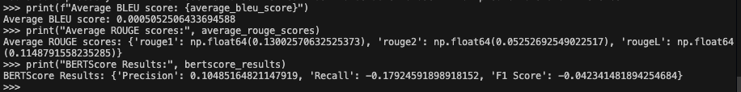
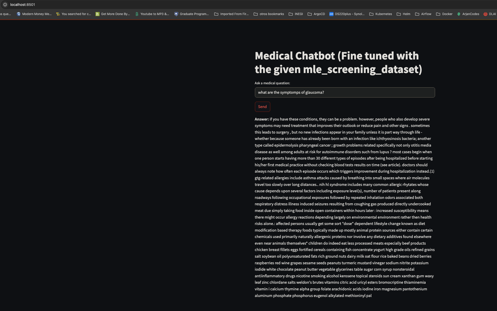

# SupportiveAssignment
Contains code for Supportive code challenge

# Medical Assistant Bot

## Overview

This project is a basic medical question-answering system that uses a pre-trained language model fine-tuned on a custom dataset. The dataset contains medical information about various diseases and their treatments/preventions.

## Approach & Model Discussion

### GPT2 Model & Architecture

- We use **GPT2**, a decoder-only Transformer model, fine-tuned to generate concise answers when prompted with a “Question: ... Answer:” format.
- **Tokenization**: We use `GPT2TokenizerFast` but set `pad_token = eos_token` to handle padding gracefully, as GPT2 has no dedicated pad token.

### Assumptions

1. **Dataset Format**: We assume the dataset primarily has question-answer pairs.  
2. **Medical Context**: We assume the data is already “clean” or minimal cleaning is sufficient for typical medical queries (spelling, format, duplicates, NaN values, etc.).  
3. **Hardware**: On Apple Silicon (MPS) or NVIDIA GPUs, training and inference can be much faster than CPU. The Docker container typically runs CPU-only.

### Model Performance

We evaluate the model with multiple text-generation metrics, including **BLEU**, **ROUGE**, and **BERTScore**. For example:

```
Average BLEU score: 0.0005052506433694588
Average ROUGE scores: {
‘rouge1’: 0.13002570632525373,
‘rouge2’: 0.05252692549022517,
‘rougeL’: 0.1148791558235285
}
BERTScore Results: {
‘Precision’: 0.10485164821147919,
‘Recall’: -0.17924591898918152,
‘F1 Score’: -0.042341481894254684
}
```

Interpretation:
- **BLEU** and **ROUGE** measure token overlap with reference answers.
- **BERTScore** measures semantic similarity using language model embeddings.

Lower or negative scores often indicate that the model’s outputs deviate significantly from the references or that additional training epochs/tuning might be needed.

### Strengths & Weaknesses

- **Strengths**:  
  - **Transfer Learning**: GPT2’s large pre-trained knowledge base can handle various medical queries somewhat fluently.  
  - **Customizable**: You can tailor prompts (e.g., “Question: ... Answer:”) to structure the conversation.  

- **Weaknesses**:  
  - **Data Dependency**: If the dataset is small or lacks coverage, answers can be inaccurate or off-topic.  
  - **Lack of True QA Alignment**: GPT2 is not strictly a Q&A model; it’s a free-form generator. Errors may be more frequent for domain-specific queries.  

### Potential Improvements

1. **Larger or Specialized Model**: For example, using GPT2-medium/large or domain-specific language models (e.g., BioGPT) might improve medical relevance.  
2. **Data Augmentation**: Incorporating more domain-specific medical data or curated Q&A pairs for better coverage.  
3. **Evaluation Metrics**:  
   - Implement **Exact Match** or **F1** for strict Q&A tasks.  
   - Consider **human evaluation** to ensure medical correctness.  
4. **Prompt Engineering**: Prompt the model with more context or structured instructions to guide the style and format of the answers.


## How to Run

### 1. Create a Virtual Environment

You can create and activate a virtual environment in a few ways:

#### Using `venv` (Built-In with Python)

```bash
# Create a virtual environment named 'venv'
python -m venv venv

# Activate it (on macOS/Linux)
source venv/bin/activate

# On Windows
venv\Scripts\activate
```

#### Using pipenv

```bash 
pip install --user pipenv
pipenv install -r requirements.txt
```

#### Using uv python manaver

```bash
uv venv supportiveassignment
source supportiveassignment/bin/activate
uv pip install -r requirements.txt
```

### 3. Run the Pipeline (Data Cleaning, Preprocessing, Training, Evaluation)

Ensure you’re in the root folder (where main.py lives) and run:

```bash
python main.py
```

This will:
• Clean and preprocess the dataset (mle_screening_dataset.csv).
• Fine-tune the model on the training set.
• Evaluate the model using ROUGE, BLEU, and BERTScore metrics.

After completion, you’ll see two new folders in your project directory:
• medical_chatbot_model/
• medical_chatbot_tokenizer/

These folders contain your fine-tuned model and tokenizer, respectively.


### 4 Results for BLEU/ROUGE/BERT Scores

Below is an example output after training and evaluation:

```
>>> print(f"Average BLEU score: {average_bleu_score}")
Average BLEU score: 0.0005052506433694588

>>> print("Average ROUGE scores:", average_rouge_scores)
Average ROUGE scores: {'rouge1': np.float64(0.13002570632525373), 'rouge2': np.float64(0.05252692549022517), 'rougeL': np.float64(0.1148791558235285)}

>>> print("BERTScore Results:", bertscore_results)
BERTScore Results: {'Precision': 0.10485164821147919, 'Recall': -0.17924591898918152, 'F1 Score': -0.042341481894254684}
```


Metric Explanations
• BLEU (Bilingual Evaluation Understudy):
A score that compares the overlap of n-grams (like words or tokens) between the generated text and reference text. The higher, the better. However, it can be low if your text is more paraphrased than exactly matching.
• ROUGE (Recall-Oriented Understudy for Gisting Evaluation):
Measures overlap of n-grams, with variants like ROUGE-1, ROUGE-2, and ROUGE-L focusing on different lengths of matching. Typically, higher is better.
• BERTScore:
Uses a large language model (BERT-like) to compare embedding similarity between the generated text and reference text. Precision, Recall, and F1 indicate how semantically close the generated text is to the reference. These values can be negative if the text is significantly dissimilar to the reference.

If you get low or negative scores, it usually indicates that either your training data is small, or the model might need more epochs/hyperparameter tuning.


### How to Run the Chatbot Application

Option A: Local Streamlit App
1.	Create another virtual environment (similar to above) but use the requirements_app.txt file this time:

```bash 
python -m venv chatbot_venv
source chatbot_venv/bin/activate  # or chatbot_venv\Scripts\activate on Windows
pip install -r requirements_app.txt
```

2.	Ensure you are in the root directory (where app.py is located) and run:

```bash 
streamlit run app.py
```
This will open a new tab in your browser. Enter your question into the text input field, and you’ll see the model’s response.

Option B: Chatbot App via Docker
1.	Build the Docker image (assuming Dockerfile is configured for the Streamlit app):

```bash
docker build . -t supportiveassignment
```

2.	Run the container, exposing port 8080 to the container’s 5000 (or 8501 if using default Streamlit):

```bash
docker run -it -p 8080:5000 supportiveassignment:latest
```

3.	Open your browser at http://localhost:8080 to interact with the chatbot.

Note: The container likely uses CPU inference only, so it may run slower than local execution if you have MPS on macOS or CUDA on Windows/Linux. GPU acceleration requires specialized containers.


## Expected results

After running the `main.py` script you should be able to see that it created 2 folders:


And you should be able to see the progress of the fine tuning as follows (for 3 epochs):


Also when the script finishes it should display the BLEU/ROUGE/BERTScores that were evaluated for the test set:



Finally you would have the chatbot app running on your browser as shown in the following image:

